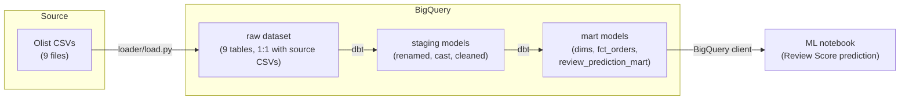
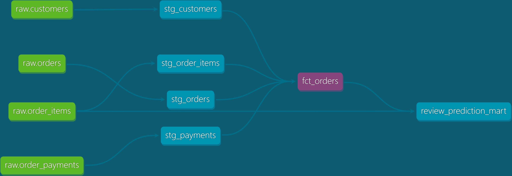

# Ecommerce ELT Pipeline

A self-contained ELT pipeline over the Olist Brazilian e-commerce public dataset: a Python loader lands raw CSVs in BigQuery, dbt Core transforms them into tested staging and mart models, and a notebook trains a model predicting **Review Score** from the resulting marts.

Built as a portfolio project to demonstrate the data-engineering step most student projects skip — most stop at "loaded a clean CSV into pandas." This one shows the full path: messy raw data → tested analytical dataset → trained model.

## Problem

A reviewer evaluating a data scientist candidate can't tell, from a notebook alone, whether the candidate can build and reason about the data layer a real analysis depends on. This project closes that gap: raw, real-world CSVs in, a queryable, tested dataset and a trained model out.

## Architecture



- **Loader** (`loader/load.py`): pandas + `google-cloud-bigquery`, one parameterized function loading any CSV into a raw table, schema derived from each file's own header (no autodetect flakiness), `allow_quoted_newlines` for multi-line review comments.
- **dbt** (`dbt/`): two-layer model structure — `staging` (1:1 with raw tables, light cleaning) and `marts` (business-grain: `dim_customers`, `dim_products`, `dim_sellers`, `fct_orders`, `review_prediction_mart`).
- **Notebook** (`notebooks/`): reads `review_prediction_mart` directly from BigQuery — no separate feature pipeline outside dbt.

Runs entirely on BigQuery's free sandbox tier (no billing account, no cost) — see [`docs/adr/0002-staged-buildout-no-orchestration-v1.md`](docs/adr/0002-staged-buildout-no-orchestration-v1.md).

## Dataset

[Olist Brazilian e-commerce public dataset](https://www.kaggle.com/datasets/olistbr/brazilian-ecommerce) — real orders from Olist Store, 2016–2018.

| Entity | Rows | Notes |
|---|---|---|
| Orders | 99,441 | grain of `fct_orders` |
| Customers | 96,096 unique | `customer_unique_id` — see [ADR 0001](docs/adr/0001-customer-grain-uses-unique-id.md) |
| Order Items | 112,650 | aggregated to Order grain in staging |
| Payments | 103,886 | aggregated to Order grain in staging |
| Reviews | 99,224 | deduped to one per Order |
| Products | 32,951 | category translated EN in staging |
| Sellers | 3,095 | |
| Geolocation | 1,000,163 raw → 19,015 zip prefixes | deduped, mean lat/lng |

Two known raw-data quirks handled explicitly: `customer_id` is order-scoped, not a stable customer key (ADR 0001), and `order_reviews` has unescaped multi-line comment fields that break naive CSV parsing (fixed in the loader, not papered over downstream).

## Setup

**Prerequisites:** Python 3.11+, a GCP project (free tier is enough — [`scripts/gcp-setup-wizard.sh`](scripts/gcp-setup-wizard.sh) walks through creating one, enabling the BigQuery API, and authenticating), the Olist CSVs in `raw_data/`.

```bash
# GCP project + auth (interactive, one-time)
bash scripts/gcp-setup-wizard.sh

# Python deps
pip install -r loader/requirements.txt
pip install -r notebooks/requirements.txt

pip install dbt-bigquery
```

**dbt profile** — create `~/.dbt/profiles.yml`:

```yaml
ecommerce_elt:
  target: dev
  outputs:
    dev:
      type: bigquery
      method: oauth
      project: <your-gcp-project-id>   # from .env after the wizard
      dataset: analytics
      location: US
      threads: 4
      priority: interactive
```

**Load raw data:**

```bash
python loader/load.py raw_data                                    # loads all 9 raw tables
python loader/load.py raw_data/olist_orders_dataset.csv raw.orders  # or load a single CSV
```

**Build the dbt project:**

```bash
cd dbt
dbt debug   # verify the BigQuery connection
dbt build   # run all staging/mart models + schema tests
```

**Run the notebook:**

```bash
jupyter nbconvert --to notebook --execute --inplace notebooks/review_score_prediction.ipynb
```

## Docs

Full dbt documentation — model lineage, column-level descriptions, source freshness — is hosted on GitHub Pages:

**[joshpeterpardosi.github.io/ecommerce-elt-pipeline](https://joshpeterpardosi.github.io/ecommerce-elt-pipeline/)**



The lineage above is `+fct_orders+` — every model the order fact depends on, and everything built from it. The same view is navigable for any model on the docs site.

[`docs/GLOSSARY.md`](docs/GLOSSARY.md) pins the domain terms the models and the notebook share — most importantly `customer_unique_id` (a person) versus `customer_id` (issued per order), and how Delivery Delay is derived.

Design decisions and their trade-offs are recorded as ADRs in [`docs/adr/`](docs/adr/).

## Findings

`notebooks/review_score_prediction.ipynb` trains a `RandomForestClassifier` (class-balanced) to predict Review Score (1–5) from `review_prediction_mart`, on an 80/20 stratified held-out split:

- **Accuracy: 0.481, macro F1: 0.310** — the label is heavily skewed toward 5-star reviews, so macro F1 (not accuracy) is the metric that matters here.
- **Delivery Delay is by far the strongest predictor** (~29% of feature importance), followed by whether the order actually reached `delivered` status and freight cost. Late or expensive-to-ship orders are the clearest signal of a bad review in this dataset — an intuitive result that also validates the pipeline: the feature the domain would predict matters most, does.

## v2 scope (next steps, not gaps)

This project intentionally ships without orchestration or CI — see [ADR 0002](docs/adr/0002-staged-buildout-no-orchestration-v1.md). The loader and dbt run manually while the modeling itself was still the focus. Planned next:

- **Orchestration**: Airflow/Dagster DAG scheduling loader → dbt → docs regeneration.
- **CI**: GitHub Actions running `dbt build` on every push, blocking merges on schema-test failures.
